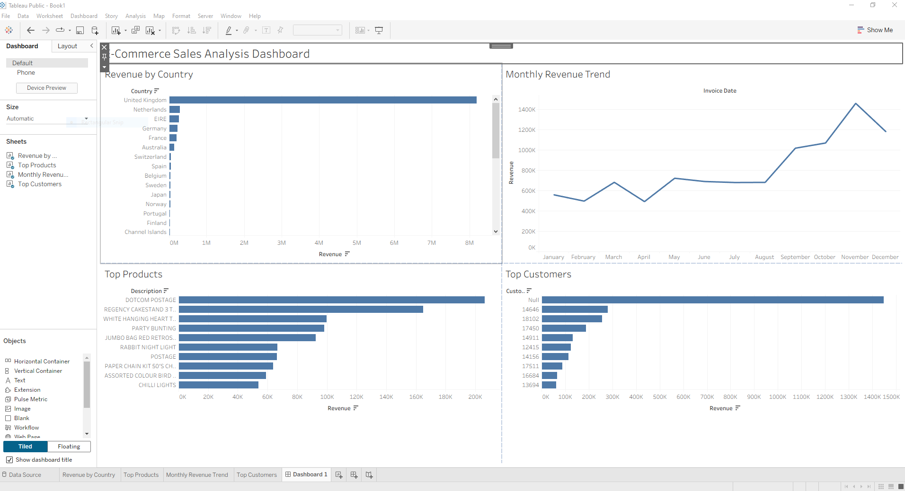

# Customer Churn Analysis

## Project Overview

This project analyzes customer churn data to identify the key factors contributing to customer attrition and provide actionable business recommendations to improve customer retention.

Customer churn is a major business problem because retaining existing customers is often more cost-effective than acquiring new ones. Using SQL, this project explores customer behavior patterns, contract types, monthly charges, and demographic trends associated with churn risk.

---

## Business Problem

A telecommunications company is experiencing customer loss and wants to understand:

* Which customers are most likely to churn
* What factors contribute to churn
* How customer retention can be improved

The goal of this analysis is to uncover business insights that can help reduce churn and improve long-term customer retention.

---

## Tools Used

* SQL (MySQL)
* Tableau
* Excel
* GitHub

---

## Dataset

The dataset contains customer account information including:

* Customer demographics
* Contract type
* Monthly charges
* Payment methods
* Internet services
* Customer tenure
* Churn status

---

## Analysis Process

### 1. Data Exploration

* Reviewed dataset structure
* Identified important customer attributes
* Examined churn distribution

### 2. SQL Analysis

Used SQL queries to analyze:

* Overall churn rate
* Churn by contract type
* Monthly charges by churn status
* Customer demographics
* Payment methods and churn trends

### 3. Data Visualization

Created dashboards and charts to visualize:

* Churn trends
* Revenue impact
* Customer segmentation
* High-risk customer groups

---

## Key Insights

* Customers on month-to-month contracts had the highest churn rates.
* Customers with higher monthly charges were more likely to churn.
* Electronic check payment users showed elevated churn behavior.
* Long-term contracts were associated with significantly lower churn rates.

---

## Business Recommendations

* Introduce loyalty incentives for month-to-month customers.
* Offer retention discounts for high-risk customer groups.
* Encourage customers to transition to longer-term contracts.
* Improve customer engagement strategies for high monthly charge customers.

---

## Project Files

* SQL queries
* Dataset
* Tableau dashboard
* Dashboard screenshots

---

## Dashboard Preview

Add your dashboard screenshot here.

Example:

---

## Skills Demonstrated

* SQL querying
* Data cleaning
* Business analysis
* Data visualization
* Dashboard development
* Analytical thinking
* Business insights communication

---

## Project Outcome

This project demonstrates the ability to use SQL and data visualization tools to analyze business problems, uncover actionable insights, and communicate findings effectively in a data analyst workflow.
