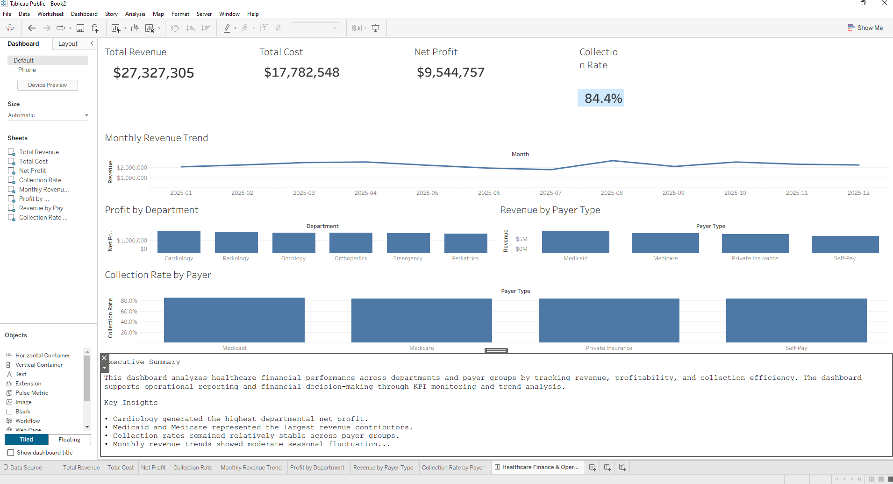

# Healthcare Finance & Operations Dashboard

## Project Overview
Developed an interactive healthcare finance dashboard in Tableau analyzing revenue, cost, profitability, payer mix, and collection performance across healthcare departments.

## Live Dashboard

[View Interactive Tableau Dashboard](https://public.tableau.com/app/profile/nicholas.valverde/viz/HealthcareFinanceDashboard_17781867464240/HealthcareFinanceOperationsDashboard?publish=yes)
## Tools Used
- Tableau
- Excel
- Healthcare KPI Analysis
- Data Visualization

## Business Questions
- Which departments generate the highest net profit?
- Which payer groups contribute the most revenue?
- How do collection rates vary across payer types?
- How does revenue trend over time?

## Key Insights
- Cardiology generated the highest departmental net profit.
- Medicaid and Medicare represented the largest revenue contributors.
- Collection rates remained relatively stable across payer groups.
- Monthly revenue trends showed moderate seasonal fluctuation.

## Dashboard Features
- KPI cards for revenue, cost, net profit, and collection rate
- Monthly revenue trend analysis
- Department profitability comparison
- Revenue by payer type
- Collection rate by payer type
- Executive summary and key insights

## Dashboard Preview

