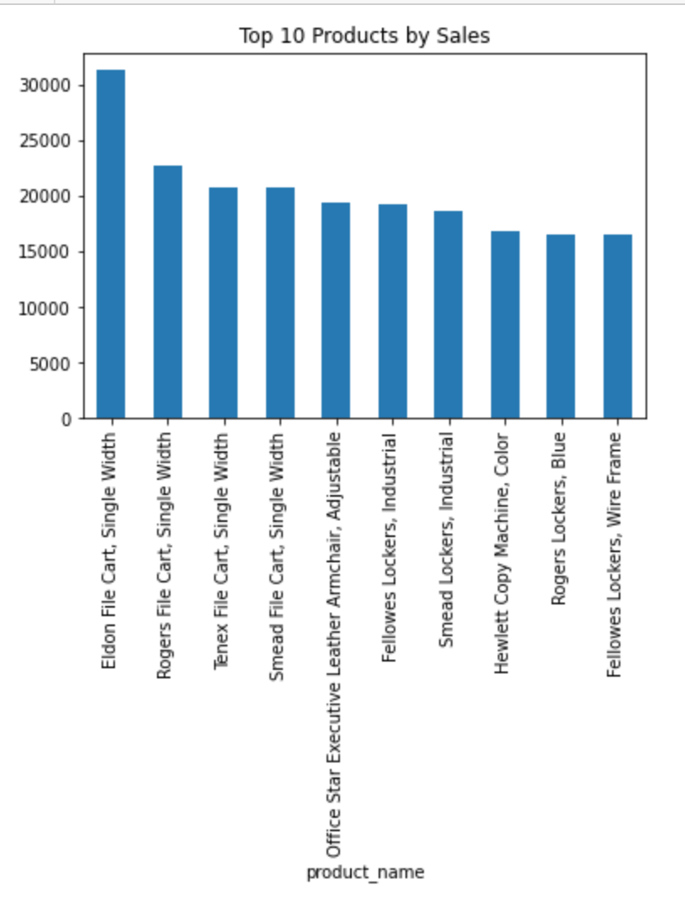

# 📊 SuperStore Sales Analysis
## 📊 Visualization

## 📌 Overview

This project analyzes retail sales data to identify key revenue drivers, evaluate regional performance, and uncover trends over time. The goal is to generate actionable insights that could support business decision-making.

---

## 🎯 Business Questions

* Which products generate the most revenue?
* Which regions perform best?
* How do sales change over time?

---

## 🛠 Tools Used

* Python (Pandas, Matplotlib)
* Jupyter Notebook

---

## 📊 Key Insights

### 🥇 Top Products

The *Eldon File Cart – Single Width* is the top-performing product by total sales of ~ $31k , indicating strong demand and a significant contribution to overall revenue.

---

### 🌎 Regional Performance

The **Central region** generated the highest total sales, making it the strongest-performing market and a key driver of revenue.

---

### 📈 Sales Trends

Sales show a steady upward trend over time, suggesting consistent business growth and increasing demand.

### 📊 Revenue Distribution
The top 5 products account for only ~1.5% of total revenue, indicating that sales are widely distributed across many products rather than concentrated in a few top performers.

---

## 💡 Business Implications

* High-performing products should be prioritized in marketing and inventory decisions
* Strong regions can be leveraged for expansion strategies
* Upward sales trends indicate positive business momentum

### 📌 Recommendation
The business should prioritize high-performing regions like Central while exploring strategies to improve performance in lower-performing regions.

---

## 📎 Project Files

* `superstore_sales_analysis.ipynb' – Data cleaning, analysis, and visualization
* `superstoreorders.csv` – Dataset
* `top_10_products.png'
* `region_sales.png'
* 'sales_over_time.png'– Visualizations

